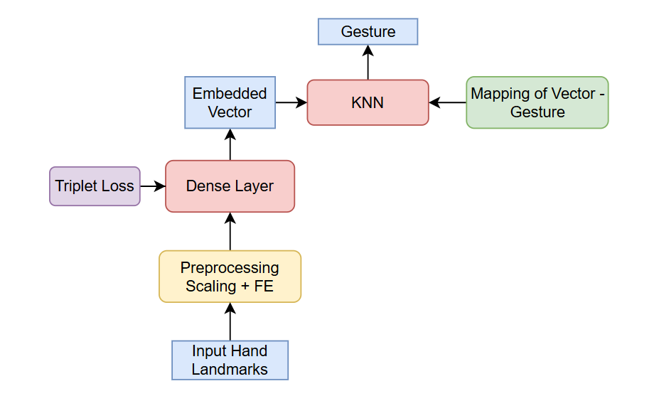

# Hand Gesture Controller - Model Design Document

This document outlines the design and plan for the new model that will be integrated into *GestCon* v2.0.0. It covers the problem it solves, data considerations, model architecture, training, evaluation, and deployment strategy.

- **Date:** August 9, 2025
- **Author:** Gia Luong Vu
- **Version:** v2.0.0-alpha

## 1. Executive Summary
### 1.1 Problem Statement

- The current version of GestCon (Hand Gesture Controller) lacks precision when applying rule-based model into prediction
    - Example: Giving the pointing down gesture is not often recognized.

- Furthermore, every time user wants to add a new gesture, they would have to code it, implement the rule themselves, which is really inconvenient.

### 1.2 Model Objective

- The model would have to classify user's gestures based on the vector result of a mediapipe hand detection (classification). 

- It would also allow new gesture to be added to the application without retraining the whole model

### 1.3 Successful Criteria

1. Accuracy and Performance
    - Static gestures: ≥ 95% classification accuracy on validation set of base gestures.

    - Incrementally added gestures: ≥ 90% accuracy after 10–20 samples per new gesture.

    - Cross-user robustness: Accuracy drop ≤ 5% when tested on unseen users (with generic training).

    - Rationale: Balances real-world variation with practical data limits.

2. Speed and Latency
    - Inference latency: ≤ 10 ms per frame on mid-range mobile CPU (~100 FPS max theoretical).

    - Online incremental update time: ≤ 1 second for adding a new gesture with ~10–20 samples.

    - Rationale: Keeps real-time responsiveness and smooth control without noticeable lag.

3. Storage Size
    - Base model weights: ≤ 2 MB (after quantization, e.g., int8 TFLite).

    - Incremental gesture data storage: ≤ 200 KB for up to 20 custom gestures (e.g., KNN prototypes or embeddings).

    - Total target: ≤ 2.5 MB including base model + incremental updates.

    - Rationale: Small enough for embedded devices and quick load/save cycles.

## 2. Data

### 2.1 Data source

- The primary data source will be the MediaPipe Hand solution. This tool provides 21 keypoints for each hand in a video stream. These keypoints are represented by their (x,y,z) coordinates, which will be the raw input features for the model. 
- Each set of 21 keypoints will be a single data point, corresponding to a specific gesture.

### 2.2 Data collection

- Data will be collected directly from users through another application, which make use of mediapipe solution and cv2 camera functionaility. 

- Users will input a specific gesture (e.g., "Thumbs Up") and the application will allow users to show the geesture and save the data, extracting the 21 hand keypoints from each frame. This collection process will generate a labeled dataset where the keypoint coordinates are the features and the gesture name is the label. 

- A minimum of 50-100 samples per gesture class will be required to ensure a robust and diverse training set.

### 2.3 Data preprocessing

The raw keypoint data needs to be processed to be useful for a machine learning model.

1. **Normalization**: The keypoint coordinates are in a relative image space. To make the model robust to hand size and position, the coordinates will be normalized. This can be done by subtracting the coordinates of a reference point (e.g., the wrist keypoint) from all other keypoints. Additionally, the coordinates will be scaled to a fixed range (e.g., 0 to 1) to account for variations in hand scale.

2. **Feature Engineering**: The normalized keypoints may be further processed to create more meaningful features, such as the distances between keypoints, angles between different bone segments, or the relative positions of finger tips. These engineered features can sometimes improve model performance by providing a more invariant representation of the gesture.

## 3. Workflow

The model takes a 63-dimensional gesture vector as input, learns a compact embedding, and compares it to stored embeddings for classification

Thus, the model is structured into two main components:

- **Embedding Network** – learns a compact, robust representation of gesture geometry.

- **Classification Head** – maps the embedding to predefined gesture categories.

### 3.1 Architecture

    

- Before the landmarks are going through the model, it is going to be processed by Scaling and Feature Engineering.

- The Embedding Network in this version only contains 2 Dense Layers, with a Triplet Loss used to train the Network.

- The classification head used is a K-Nearest Neighbor model.